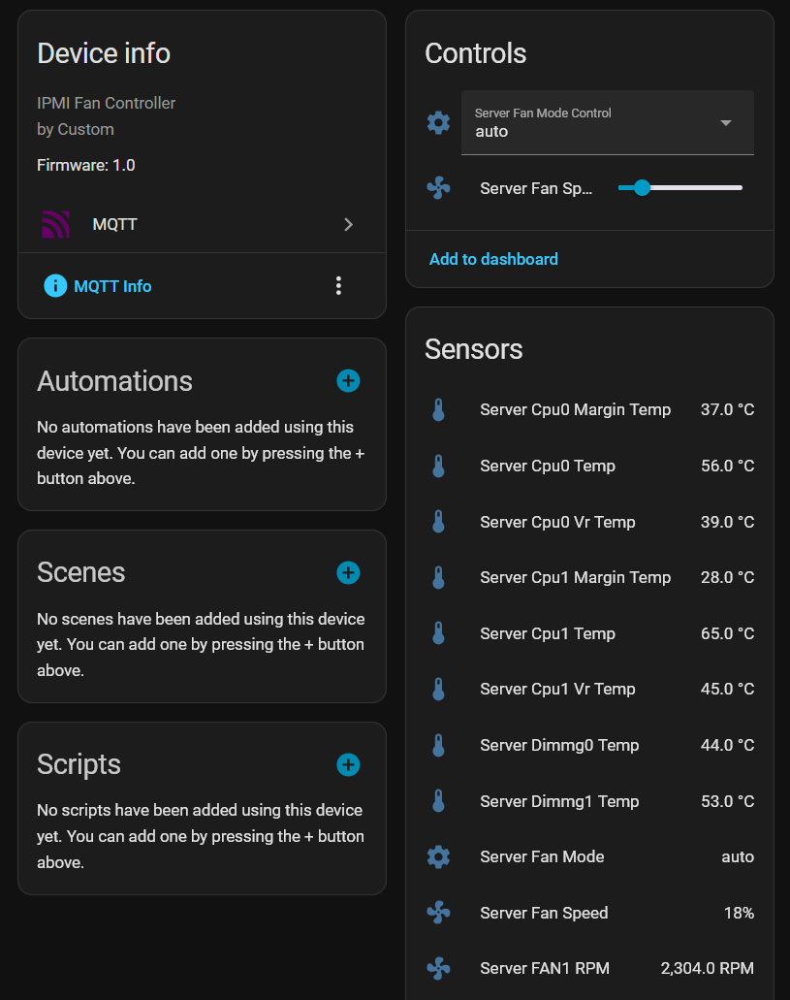

# Inspur SA5212M5
## What is it?
The Inspur SA5212M5 is an Alibaba-custom made series of servers with LGA3647 sockets and 24 DIMM slots.
The BIOS is pretty heavily locked down on Inspur units.

The same server design seems to have been submitted to multiple server vendors, known to me being Inspur, Inventec and Foxconn.
They seem to be sold off at the moment, probably replaced with a better solution.
I've yet to find a method of manually controlling the fans on the Inventec servers.

## fanctl.py
fanctl.py is a script I had Claude throw up that will keep the fans in check via HTTP over the webinterface.
Unfortunately I could not find another interface the BMC would expose that allows me to control the fans 'manually' (as in, implement my own fan curve).
ipmitool failed me at every step, but it is possible to inject different steps into the HTTP request for 'manual fan control' in the BMC (20/50/75/100).
Catching the PUT request that is sent when clicking that button shows that it is really being transmitted as a json object: {'duty': 20}, which takes any number from 0 to 100.
On my units, most fans won't start up correctly before I exceed 10%. However, the noise reduction going from 20% to 15% is already quite strong.

If you have MQTT, this script can also expose the controls and sensors to Home Assistant.

## Powering hard drives
If your system does not come with a backplane, as many of these do, you will face the issue that all the power supply ports on the board have 12V power only.
If you don't want to buy a backplane, it can be done on the cheap if you are willing to solder.

This device will add the 5V power rail that is needed to power the hard disk circuitry: https://de.aliexpress.com/item/1005007260232987.html
Problem is, the connector isn't quite right. I ended up buying the PCie connector version of this and cutting up a PCIe power lead I had, carefully connecting 12V pins on the board to 12V pins on the AliExpress device using a multimeter and some solder heatshrink. Doing this provided me with the 5V I need to power the HDD circuitry, and now my server detects all hard drives.

Please note that the onboard sSATA/SATA ports are not SAS-capable on my unit. There seem to be a 'standard' and 'lower cost' version of this server according to the manual and online information, but I couldn't find an explanation what the differences are.

## Confusion about other SA5212M5 / NF5212M5 / SA5212H5

There seem to be a number of models that follow this naming scheme, but are quite different. On AliExpress, there are parts sold for what appears to be this server, but which aren't compatible with it at all. One example would be the 'mini' type PCIe power connector cables that are sold on AliExpress, but the server I have does not actually have any of these connectors on the board. 
